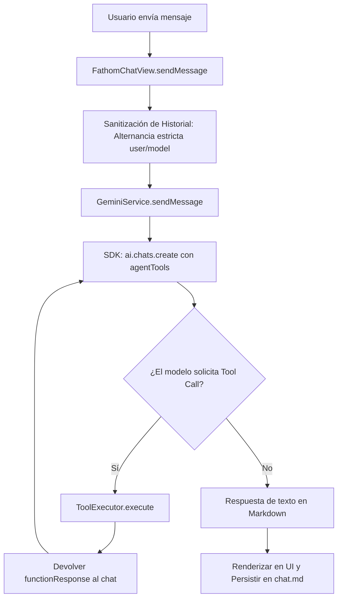

# Arquitectura del Plugin - Obsidian Fathom Assistant

## 1. Visión General y Stack Tecnológico

**Obsidian Fathom Assistant** es un plugin para [Obsidian](https://obsidian.md/) que integra un Agente de Inteligencia Artificial conversacional propulsado por el motor **Google Gemini** en el panel lateral de la bóveda. El asistente está diseñado para ser consciente del contexto de tus notas, gestionar el historial de conversaciones de forma transparente (autoexcluido del grafo de notas) y ejecutar herramientas avanzadas tanto en la bóveda como sobre el backend de **Fathom Notebook**.

### Componentes Tecnológicos
- **Lenguaje Base:** TypeScript con tipado estricto.
- **Compilador / Bundler:** `esbuild` (`esbuild.config.mjs`).
- **SDK de Inteligencia Artificial:** `@google/genai` (SDK oficial de Google Gemini v2.x).
- **Plataforma:** Obsidian API (`obsidian`), vista lateral basada en `ItemView` (`VIEW_TYPE_FATHOM_CHAT`).
- **Estilos:** CSS desacoplado (`styles.css`) apoyado en variables de tema nativas de Obsidian.

---

## 2. Estructura del Código Fuente

```text
c:\Programacion\Github\obsidian-fathom-assistant\
├── docs/                        # Documentación técnica, decisiones y guías
│   ├── arquitectura.md          # Arquitectura del sistema y diseño técnico (este documento)
│   ├── guia_usuario.md          # Manual de usuario y casos de uso
│   ├── decisiones.md            # Registro de Decisiones de Arquitectura (ADR)
│   └── herramientas_agente.md   # Catálogo exhaustivo de herramientas del agente
├── agent/                       # Motor del Agente y ejecución de herramientas
│   ├── gemini-service.ts        # Servicio de integración con el SDK oficial de Gemini
│   ├── executor.ts              # ToolExecutor: ejecución de acciones en bóveda y CLI
│   └── tools.ts                 # Declaraciones formales de herramientas (FunctionDeclaration)
├── main.ts                      # Controlador de la vista (FathomChatView), ciclo de vida y settings
├── styles.css                   # Hoja de estilos de la interfaz (diseño Antigravity)
└── manifest.json                # Metadatos del plugin para Obsidian
```

---

## 3. Arquitectura del Agente (`GeminiService`)

El servicio `GeminiService` (`agent/gemini-service.ts`) encapsula toda la comunicación con la API de Google Gemini utilizando el nuevo SDK `@google/genai`:



### 3.1. Sanitización Estricta de Historial
La API de Gemini impone reglas estrictas de estructura de diálogo:
1. El historial debe comenzar siempre con un mensaje con rol `user`.
2. No pueden existir dos mensajes consecutivos con el mismo rol (se fusionan automáticamente en un único bloque de texto).
3. El último mensaje del historial previo antes de un nuevo prompt debe ser obligatoriamente de rol `model`. Si no lo es, el sanitizador inyecta un reconocimiento neutro (`Entendido, continúa.`).

### 3.2. Normalización de Carga Útil (ContentUnion Bug Bypass)
El SDK v2.x de `@google/genai` presenta restricciones en los validadores de esquema cuando se envían matrices de partes mixtas. Si el prompt contiene únicamente una cadena de texto sin adjuntos binarios, `GeminiService` lo extrae y envía como un string primitivo directo, garantizando cero fallos de validación en tiempo de ejecución.

### 3.3. Bucle de Resolución de Herramientas (Tool Calling Loop)
Cuando Gemini emite una llamada a función (`response.functionCalls`), el orquestador intercepta la invocación, la envía al `ToolExecutor` correspondiente y retorna el resultado en un mensaje de tipo `functionResponse`. El bucle cuenta con un límite de salvaguarda de `maxIterations = 5` para neutralizar llamadas recursivas infinitas.

---

## 4. Motor de Herramientas (`ToolExecutor` y `agentTools`)

Las herramientas expuestas al modelo amplían las capacidades de la IA más allá de una conversación aislada:

| Herramienta | Capa de Ejecución | Descripción |
| :--- | :--- | :--- |
| `read_current_note` | Vault API (Obsidian) | Lee el contenido de la nota activa en el editor del usuario. |
| `query_vault` | Vault API (Obsidian) | Realiza búsquedas de archivos Markdown relevantes en la bóveda. |
| `add_domain_mapping` | CLI Backend (Node.js) | Llama a `npm run cli add-mapping` en Fathom Notebook para asociar dominios a clientes. |
| `inject_participants` | CLI Backend (Node.js) | Llama a `npm run cli add-override` en Fathom Notebook para forzar participantes en una sesión. |
| `trigger_fathom_sync` | CLI Backend (Node.js) | Llama a `npm run cli sync` en Fathom Notebook para procesar nuevas reuniones. |

Las llamadas al backend se ejecutan mediante `child_process.exec` sobre el directorio configurado en `fathomRepoPath`.

---

## 5. Gestión del Contexto Dinámico (Context-Aware)

El plugin permite suministrar contexto activo al modelo sin necesidad de copiar y pegar manualmente:
1. **Menús Contextuales de Obsidian:** El plugin registra handlers en `file-menu` y `files-menu`. Al hacer clic derecho sobre cualquier archivo o carpeta en el explorador de Obsidian, aparece la opción *"Añadir contexto a Fathom Assistant"*.
2. **Chips Visuales:** Los archivos o carpetas seleccionados se representan como etiquetas visuales (chips) en la parte superior del cuadro de entrada de texto, con botón de eliminación rápida (`×`).
3. **Inyección en Prompt:** Al enviar el mensaje, el contenido íntegro de las notas (o de todas las notas dentro de la carpeta seleccionada) se concatena al prompt del usuario como un bloque de contexto delimitado.

---

## 6. Persistencia de Conversaciones y Auto-Exclusión

### Almacenamiento en Markdown Puro
Cada conversación se almacena como una nota Markdown estándar dentro de la carpeta configurada (por defecto `Fathom Chats/`). Esto garantiza que el historial sea legible, versionable y respaldado junto con el resto de la bóveda.

### Auto-Exclusión de Obsidian (`userIgnoreFilters`)
- **Problema:** Tener decenas de conversaciones de chat almacenadas en la bóveda contamina la búsqueda global (`Ctrl + Shift + F`), el explorador de archivos y el grafo de relaciones de notas.
- **Solución Arquitectónica:** Al inicializarse, el plugin consulta la configuración interna de exclusiones de Obsidian (`app.vault.getConfig('userIgnoreFilters')`). Si la carpeta de chats no está presente, la añade programáticamente.
- **Resultado:** La carpeta de chats permanece invisible en las búsquedas y el grafo de Obsidian, pero el plugin mantiene acceso directo mediante la API de Vault. Además, la cabecera incluye un botón con icono de carpeta para revelar la carpeta en el explorador de archivos cuando el usuario lo desee.

---

## 7. Experiencia de Usuario y Diseño de Interfaz (UI/UX)

La interfaz gráfica sigue los lineamientos estéticos del chat de **Antigravity**:
- **Estructura en Dos Capas:** Caja de entrada de texto fluida y autoexpansible, complementada por un pie de chat sutil que alberga el botón `+` para adjuntos y el selector dinámico de modelos.
- **Selector de Modelos en Tiempo Real:** Permite alternar al vuelo entre `gemini-2.5-flash`, `gemini-2.5-pro`, `gemini-3.1-flash`, `gemini-3.1-pro`, `gemini-3.6-flash`, `gemini-3.6-pro` y `gemini-3.7-flash`.
- **Cancelación Instantánea (`AbortController`):** Mientras el modelo está generando una respuesta, el botón de envío se transforma en un **cuadrado rojo**. Al hacer clic, aborta de inmediato la petición de red y detiene la generación al milisegundo.
- **Copiado de Markdown en 1 Clic:** Al pasar el ratón sobre cualquier respuesta de la IA, aparece un botón flotante que copia el texto original en formato Markdown, preservando tablas, listas y bloques de código intactos.
- **Soporte Multimodal:** Permite adjuntar imágenes locales mediante selector de archivos, arrastre (drag & drop) o pegado directo desde el portapapeles (`Ctrl + V`).
